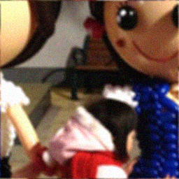
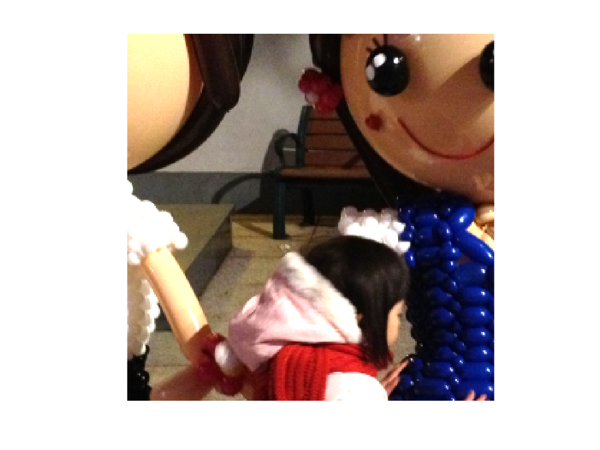
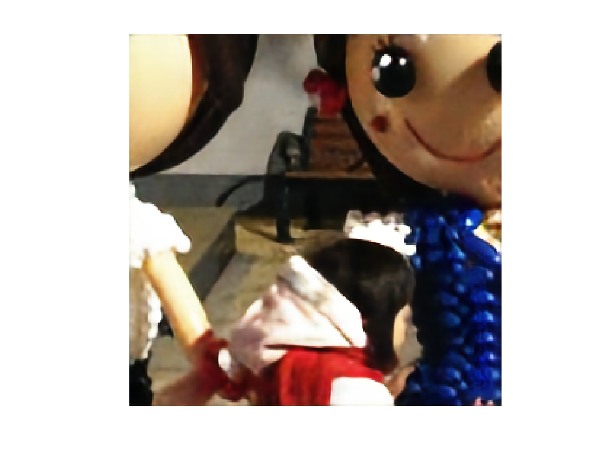

# unfoldedVBA
## Unrolled Variational Bayesian Algorithm for Image Blind Deconvolution
This repository contains the Pytorch implementation of the unrolled variational Bayesian algorithm applied to the problem of image blind deconvolution for grayscale or color images with the existence of the Gaussian noise.

Here is one example that displays the degraded image, the groundtruth image and the restored image from unfoldedVBA respectively. 
<p float="left">



</p>

## Dependencies
Python version 3.6.10\
Pytorch 1.7.0\
CUDA 11.0\
opencv-python 3.4.1.15
numpy 1.19.5
> if you have errors like ImportError: libGL.so.1: cannot open shared object file: No such file or directory when import cv2,
> please use the following code to fix it

```
sudo apt update
sudo apt install libgl1-mesa-glx
```

## Datasets
The datasets are in [Datasets](https://www.dropbox.com/sh/3hai04tkubjoxa3/AAASNdVsrwV3SoyS2BRtsVRKa?dl=0). Please download this folder and put it in the main folder _unfoldedVBA_. The subfolder _Testsets_ contains the grayscale testsets and the subfolder _Testsets_RGB_ contains the color testsets. 

## Training
To save the time during the trainings, there are some constant variables saved in a .mat file in [useful_tools.mat](https://www.dropbox.com/s/lyxf4zyi1nb06hb/useful_tools.mat?dl=0). Please download this file and put it in the subfolder _Model_files_. Please download the .txt file in [KmtK0_dict](https://www.dropbox.com/s/19q428p3zejqs45/KmtK0_dict.txt?dl=0) and put it in the main folder _unfoldedVBA_.


## Test
The learned models are in [Trainings](https://www.dropbox.com/sh/0e1gzsalme04pf4/AABaZ4D0Qna9z-M1o2D7xpAZa?dl=0). Please download this folder and put it in the main folder _unfoldedVBA_. The subfolder _Gaussian_ contains the saved models for grayscale images and the subfolder _Mixed_ contains the saved models for color images.

## Demo file
demo_unfoldedVBA.ipynb: shows how to test and train unfoldedVBA for grayscale images\
demo_unfoldedVBA_RGB.ipynb: shows how to test and train unfoldedVBA for color images

## Authors
Yunshi HUANG - e-mail: yunshi.huang@centralesupelec.fr - PhD Student\
Emilie Chouzenoux -[website](http://www-syscom.univ-mlv.fr/~chouzeno/)\
Jean-Christophe Pesquet -[website](https://pesquet.info/)
